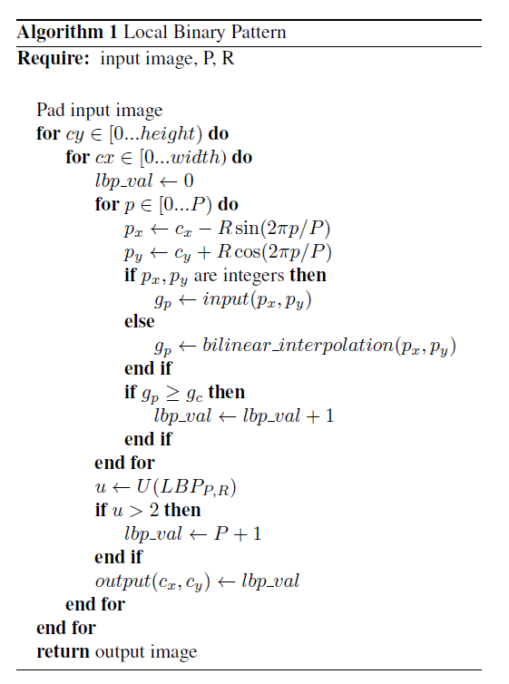
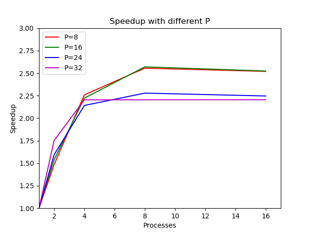
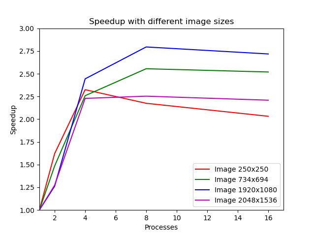

# Local Binary Pattern

An implementation of the Local Binary Pattern operator in Python using Joblib to achieve parallelization. The algorithm uses the parameters P (neighbourhood size) and R (radius of the circular neighbourhood) to compute the LBP label of each pixel. To reduce the total number of possible labels *uniform patterns* are used.

## Implementation

The implementation is done in Python and uses the *Pillow* package to load and save images in grayscale, and the *numpy* package for handling arrays. 

The pseudo-code of the LBP operator is the following:

The image is padded by adding a frame of pixels with the constant value of 0 and is done by using the numpy function `pad`. This is necessary for the computation of the LBP labels of the edges and to allow any radius to be used as a parameter

Finally, the output array is used to compute the histogram and then both histogram and image are saved on a file. 

## Parallelization

To achieve parallelization, the image was split in sub-images of equal size and each slice was used by a Joblib process to perform the LBP operator.
To avoid the copy of the input image for each process, and as a consequence a slow instantiation, the `joblib.dump()` and `joblib.load()` functions to save and reload the numpy array efficiently were used.
So the main process saves the array on disk and deletes it at the end of the function, while each process loads the file to perform the LBP algorithm.

To recap, the main process:
* Saves the padded array on disk in a compressed format.
* Splits the original image in sub-images.
* Instantiates the sub-processes with the `Parallel` class, each with their own parameters.
* After all sub-processess terminate, the output image is built from the returned slices.

While each process performs the LBP operator for its image slice.

## Speedup Results

Speedup results with a fixed test image of size 734x694 with varying values for the parameter P (neighbourhood size) and R = 1 (radius of the circular neighbourhood).

Speedup results with P = 8, R = 1 and input images of different sizes.

## References

* [Local Binary Pattern](http://www.scholarpedia.org/article/Local_Binary_Patterns)
* [Multiresolution gray-scale and rotation invariant texture classification with local binary patterns](https://ieeexplore.ieee.org/document/1017623)